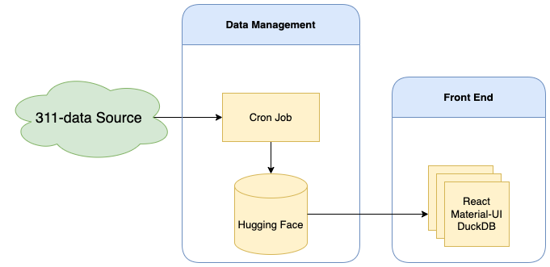

# Project Overview
Welcome! This readme assumes you have already listened to the 311-data pitch, and gone through the basic onboarding. The following will be more geared towards the programming side of 311-data and getting your development environment setup. If you run into any problems, please submit a new issue.

Before we dive into contributing the project, going through each component of the project that might help you gain quick understanding about how they integrate into our project.

Here is our architecture diagram. 

## Recurring 311-data Update
Our data is obtained from [MyLA311 Service Request Data](https://data.lacity.org/browse?q=myla311%20service%20request%20data&sortBy=relevance) and updated on a daily basis. 
## DuckDB
Since we do not have a backend server, we use DuckDB to process and store data from CSV files obtained as mentioned previously. 
## Front End
The front end is written in React/Redux as the application is a reporting dashboard with several visualizations driven by sets of filters. If you are unfamiliar, we recommend starting [here](https://hackernoon.com/getting-started-with-react-redux-1baae4dcb99b).

# Git Operations
If you have prior experiences with git, you can skip this section.
## Git 101
1. Clone a Repository: `git clone https://github.com/hackforla/311-data.git`
2. Add Changes: `git add <file_name>`
3. Commit Changes: `git commit -m "<commit_message>"` (provide a message to describe changes)
4. Push Changes to Repo: `git push origin <branch_name>`
5. Note: make sure you sync with the repo by `git fetch` and `git pull`
## Feature Branching
For development we use feature branching to ensure easy collaboration. There aren't any rules to branch naming or how many branches you are allowed to have, but the recommended convention would look like `issueId-Prefix-MinimalDescription`
For example, a documentation branch could look like `1534-feature-description` by creating a new branch with `git checkout -b 1534-feature-description`


Read more about feature branching [here](https://www.atlassian.com/git/tutorials/comparing-workflows/feature-branch-workflow).

# Quick Start
* Ensure that node version manager (nvm) is installed (e.g. follow a [tutorial](https://heynode.com/tutorial/install-nodejs-locally-nvm/))
* Run `nvm install lts/erbium`
* Run `nvm use lts/erbium`
* Confirm you are using Node 12 by running `node -v` (e.g. `Now using node v12.22.12 (npm v6.14.16)`)
* Clone the repo
* cd 311-data/
* cp .example.env .env
* Edit .env and supply a valid MAPBOX_TOKEN. If you are a member of hack4la, please contact someone in 311-engineering for one
* npm run setup && npm start
* Visit http://localhost:3000


## Virtual Environments
Package management in python is handled through our [requirements.txt](https://github.com/hackforla/311-data/blob/master/server/api/requirements.txt). When cloning the repo, this file should allow any python developer to retrieve all the requirements necessary to run the backend. A virtual environment is an organizational structure to isolate your pip dependencies.
It is recommended to review [this](https://www.geeksforgeeks.org/python-virtual-environment/) to get your bearings on virtual environments.
For consistency's sake, it is recommended to create your virtual environment like this: `virtualenv -p python3 ~/.envs/311-data`.
This will create the virtual enviroment in the home folder under `.envs` and it will use python3 as the interpreter.

Running this command does not mean you are _in_ the virtual environment yet. in order to utilize the environment, run `source ~/.envs/311-data/bin/activate` and your terminal should now be prefixed with `(311-data)`.


## API Secrets
We use `.env` files to store secrets and other configuration values. These files are excluded from version control so that secrets are not pushed to our public repository. If you update one of the example `.env` value to include new configuration, be sure not to include secrets when you push to Github.

## Socrata API
We use an api called Socrata to pull 311-related data from `data.lacity.org`. The cool thing about this api is that you can send sql requests, including aggregates. The even cooler thing is that we can ask for a substantial amount of information by using the `$limit` parameter.
An example of this request would look like this:
```
https://data.lacity.org/resource/pvft-t768.csv
?$select=Address,count(*)+AS+CallVolume
&$where=date_extract_m(CreatedDate)+between+1+and+12+and+RequestType=%27Bulky%20Items%27+and+NCName=%27ARLETA%20NC%27
&$group=Address&$order=CallVolume%20DESC
&$limit=50000000
```

# Code Quality
When contributing code to the project, there are some principles to bear in mind:
## Readability: 
1. Proper indentation, comments and documentation
2. Meaningful variable names
3. Consistent coding style

## Scalability
1. Modularized functions
2. Proper error and exception handling 

## Maintainability
1. Avoid unnecessary complexity
2. Follow a clear and logical structure